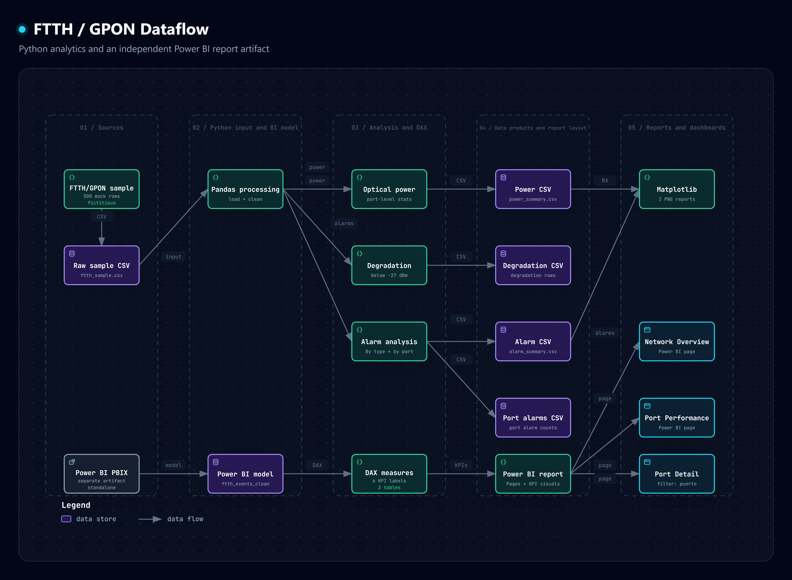
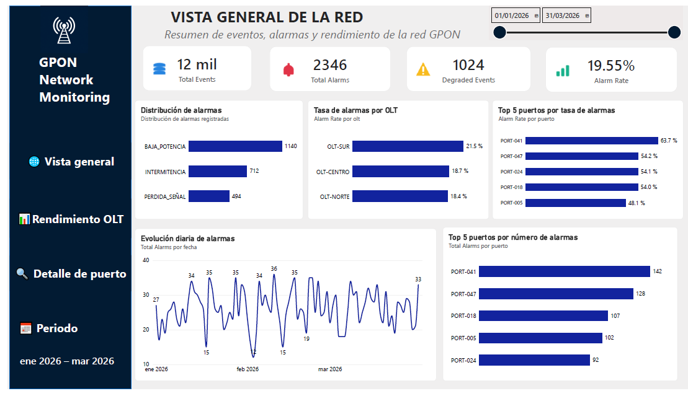
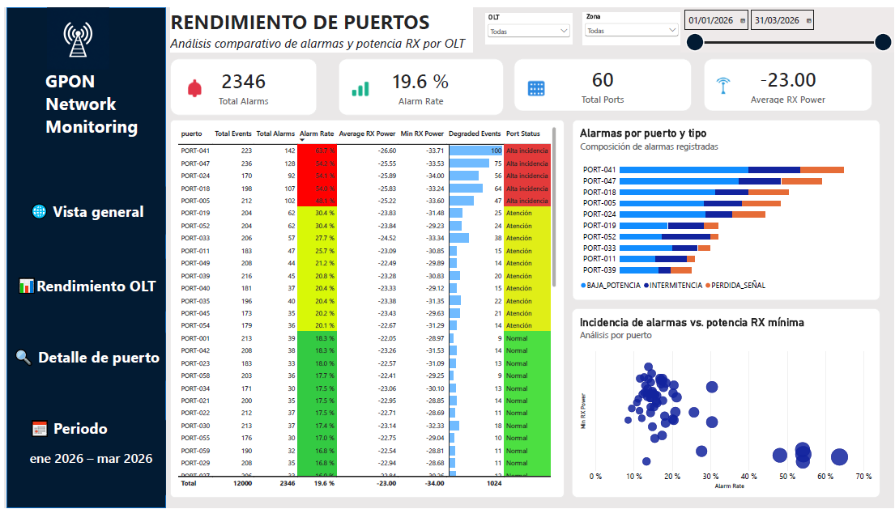
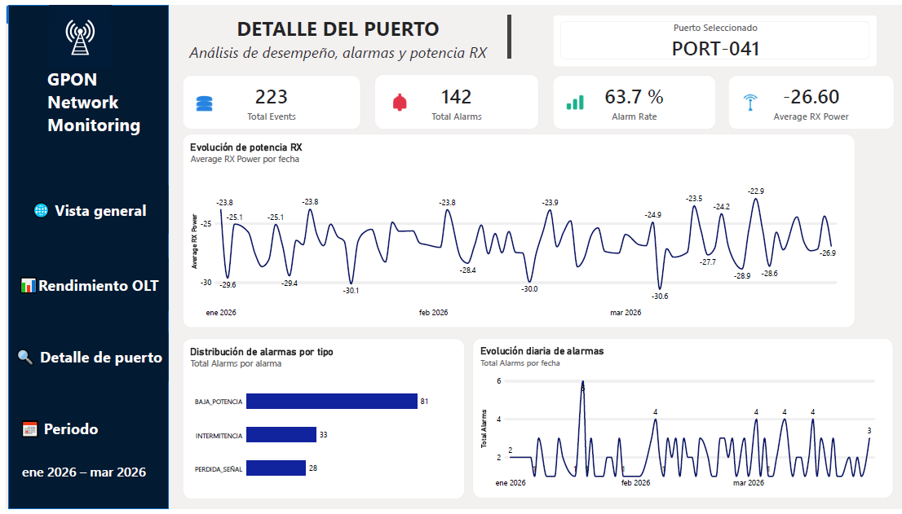

# FTTH / GPON Data Analysis

Proyecto de **Data Analytics y Business Intelligence** aplicado al análisis operativo de una red FTTH/GPON.

El proyecto combina procesamiento y análisis de datos con **Python** y una solución de visualización interactiva desarrollada en **Power BI**, con el objetivo de identificar patrones de alarmas, comportamiento de la potencia óptica, eventos degradados y puertos con mayor incidencia.

> **Nota:** todos los datos utilizados en este proyecto son ficticios y fueron creados exclusivamente con fines demostrativos. No contienen información real de clientes ni información confidencial.

---

## Objetivo

Transformar datos operativos de una red FTTH/GPON en información útil para apoyar el análisis técnico y la identificación de posibles puntos críticos.

El proyecto permite analizar:

- Eventos y alarmas de red.
- Tipos de alarmas más frecuentes.
- Distribución de alarmas por puerto.
- Potencia óptica RX.
- Eventos asociados a degradación.
- Desempeño por OLT.
- Puertos con mayor incidencia.
- Indicadores para monitoreo de la red.

---

## Arquitectura del proyecto

El proyecto está organizado en dos capas analíticas:

- **Python Analytics:** generación, limpieza y procesamiento de datos, análisis de potencia, degradación y alarmas.
- **Power BI Analytics:** modelado, medidas DAX, KPIs y dashboard interactivo.

La arquitectura fue documentada mediante **Archify**, utilizando la estructura real del repositorio como referencia.



> **Nota:** Python y Power BI se mantienen como capas analíticas independientes. No se representa una conexión directa entre los CSV generados por Python y el modelo de Power BI porque dicha relación no está demostrada por el repositorio.

---

## Dashboard Power BI

El dashboard fue diseñado para analizar la red desde una visión general hasta el detalle individual de cada puerto.

### 1. Vista general de la red

Permite obtener una visión general del comportamiento de la red mediante KPIs, distribución de alarmas, análisis por OLT y evolución temporal.



**Principales indicadores:**

| Indicador | Resultado |
|---|---:|
| Total de eventos | 12,000 |
| Total de alarmas | 2,346 |
| Eventos degradados | 1,024 |
| Tasa de alarmas | 19.55% |

---

### 2. Rendimiento de puertos

Permite identificar los puertos con mayor incidencia y analizar su comportamiento mediante tasa de alarmas, potencia RX y eventos degradados.



Incluye:

- Total de alarmas.
- Tasa de alarmas.
- Potencia RX promedio.
- Potencia RX mínima.
- Eventos degradados.
- Alarmas por tipo.
- Análisis de incidencia frente a potencia RX.
- Estado analítico del puerto.
- Filtros por OLT, zona y fecha.

---

### 3. Detalle del puerto

Permite realizar un análisis individual mediante **drill-through por puerto**.



Permite analizar:

- Total de eventos.
- Total de alarmas.
- Tasa de alarmas.
- Potencia RX promedio.
- Evolución de potencia RX.
- Distribución de alarmas.
- Evolución diaria de alarmas.

---

## Hallazgos principales

### Alarmas

Las principales categorías de alarma identificadas en el análisis fueron:

- **BAJA_POTENCIA**
- **INTERMITENCIA**
- **PERDIDA_SEÑAL**

La baja potencia representa la mayor cantidad de alarmas dentro del conjunto analizado.

### Desempeño por OLT

| OLT | Tasa de alarmas aprox. |
|---|---:|
| OLT-SUR | 21.5% |
| OLT-CENTRO | 18.7% |
| OLT-NORTE | 18.4% |

**OLT-SUR** presenta la mayor tasa de alarmas dentro del conjunto analizado.

### Puertos con mayor incidencia

Los cinco puertos principales aparecen tanto entre los de mayor cantidad absoluta de alarmas como entre los de mayor tasa de incidencia:

| Puerto | Tasa de alarmas | Total de alarmas |
|---|---:|---:|
| PORT-041 | 63.7% | 142 |
| PORT-047 | 54.2% | 128 |
| PORT-024 | 54.1% | 92 |
| PORT-018 | 54.0% | 107 |
| PORT-005 | 48.1% | 102 |

Estos puertos representan puntos prioritarios para revisión dentro del escenario demostrativo.

---

## Análisis con Python

La primera capa del proyecto implementa un flujo reproducible para trabajar con datos FTTH/GPON.

```text
Datos FTTH/GPON
       ↓
Generación / carga de datos
       ↓
Limpieza y normalización
       ↓
Análisis de potencia óptica
       ↓
Detección de posibles degradaciones
       ↓
Análisis de alarmas
       ↓
Generación de datasets procesados
       ↓
Reportes con Matplotlib
```

### Procesamiento de datos

El proyecto realiza:

- Normalización de nombres de columnas.
- Eliminación de registros duplicados.
- Identificación de valores nulos.
- Generación de resúmenes del dataset.

### Análisis de potencia óptica

Se calculan estadísticas de potencia por puerto:

- Valor mínimo.
- Valor máximo.
- Promedio.
- Mediana.

También se identifican registros por debajo de un umbral demostrativo para revisión de posibles degradaciones.

### Análisis de alarmas

Se generan indicadores sobre:

- Cantidad de alarmas por tipo.
- Cantidad de alarmas por puerto.
- Distribución de eventos.

### Generación de reportes

Los resultados procesados se almacenan en archivos CSV y se generan visualizaciones mediante Matplotlib.

---

## Power BI y DAX

Se desarrollaron medidas DAX para construir los principales KPIs del dashboard.

### Total de eventos

```DAX
Total Events =
COUNTROWS(ftth_events_clean)
```

### Total de alarmas

```DAX
Total Alarms =
CALCULATE(
    [Total Events],
    ftth_events_clean[es_alarma] = TRUE()
)
```

### Tasa de alarmas

```DAX
Alarm Rate =
DIVIDE(
    [Total Alarms],
    [Total Events],
    0
)
```

### Potencia RX promedio

```DAX
Average RX Power =
AVERAGE(
    ftth_events_clean[potencia_rx_dbm]
)
```

### Total de puertos

```DAX
Total Ports =
DISTINCTCOUNT(
    ftth_events_clean[puerto]
)
```

### Potencia RX mínima

```DAX
Min RX Power =
MIN(
    ftth_events_clean[potencia_rx_dbm]
)
```

### Eventos degradados

```DAX
Degraded Events =
CALCULATE(
    [Total Events],
    ftth_events_clean[es_degradado] = TRUE()
)
```

---

## Clasificación analítica de puertos

Para facilitar la identificación de puntos que requieren atención se definieron los siguientes criterios para este proyecto:

| Tasa de alarmas | Estado |
|---|---|
| < 20% | Normal |
| 20% – < 40% | Atención |
| ≥ 40% | Alta incidencia |

> Estos umbrales son **criterios analíticos definidos para este proyecto demostrativo** y no representan límites universales de operación de redes FTTH.

---

## Resultados del análisis Python

El dataset demostrativo utilizado por el flujo Python contiene inicialmente:

- **500 registros**
- **3 columnas**

Después del proceso de limpieza:

- **499 registros**
- **3 columnas**
- **0 valores nulos**
- **56 registros identificados para revisión por posible degradación**

### Distribución de eventos

| Evento | Cantidad |
|---|---:|
| Sin alarma | 323 |
| Baja potencia | 74 |
| Intermitencia | 51 |
| Pérdida de señal | 51 |

Estos resultados corresponden exclusivamente al dataset ficticio utilizado para demostrar el flujo de procesamiento.

---

## Reportes generados

El procesamiento en Python genera reportes gráficos mediante Matplotlib:

- `reports/alarm_distribution.png`
- `reports/average_power_by_port.png`

---

## Tecnologías utilizadas

### Lenguajes y análisis

- Python
- DAX

### Librerías

- Pandas
- NumPy
- Matplotlib

### Business Intelligence

- Power BI
- Power Query
- DAX
- Drill-through
- Conditional Formatting
- Interactive Filtering

### Herramientas

- Git
- GitHub
- Visual Studio Code
- Archify

---

## Estructura del proyecto

```text
FTTH-DATA-ANALYSIS/
│
├── assets/
│   ├── ftth-gpon-dataflow.png
│   └── dashboard/
│       ├── vista-general-red.png
│       ├── rendimiento-puertos.png
│       └── detalle-puerto.png
│
├── data/
│   ├── raw/
│   │   └── ftth_sample.csv
│   │
│   └── processed/
│       ├── alarm_summary.csv
│       ├── alarms_by_port.csv
│       ├── degradation_analysis.csv
│       └── power_summary.csv
│
├── reports/
│   ├── alarm_distribution.png
│   └── average_power_by_port.png
│
├── src/
│   ├── alarm_analysis.py
│   ├── create_report.py
│   ├── data_processing.py
│   ├── generate_sample_data.py
│   ├── main.py
│   └── power_analysis.py
│
├── .gitignore
├── FTTH_Network_Monitoring.pbix
├── README.md
└── requirements.txt
```

---

## ¿Qué demuestra este proyecto?

Este proyecto demuestra experiencia práctica en:

- Limpieza y transformación de datos.
- Análisis exploratorio.
- Automatización de procesos con Python.
- Análisis de datos operativos.
- Análisis de potencia óptica.
- Identificación de posibles degradaciones.
- Análisis de alarmas.
- Modelado y análisis en Power BI.
- Creación de medidas DAX.
- Diseño de KPIs.
- Visualización de datos.
- Análisis por OLT, zona y puerto.
- Uso de filtros interactivos.
- Drill-through.
- Identificación de patrones y puntos críticos.
- Comunicación de hallazgos mediante dashboards.
- Documentación de arquitectura de datos.

---

## Disclaimer

Este proyecto utiliza datos **completamente ficticios y anonimizados**.

No representa una red FTTH/GPON real ni contiene información de clientes, infraestructura real o información confidencial.

Los umbrales y criterios utilizados en algunos análisis son demostrativos y fueron definidos específicamente para este proyecto.

---

## Portfolio

Proyecto desarrollado como parte de mi portafolio de **Data Analytics / Business Intelligence**, con enfoque en análisis de datos operativos, automatización, visualización y toma de decisiones basada en datos.